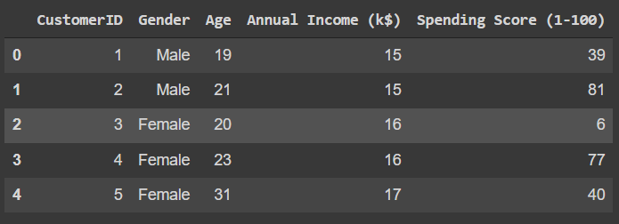
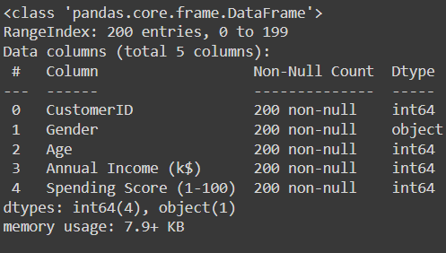
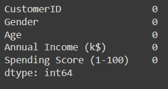
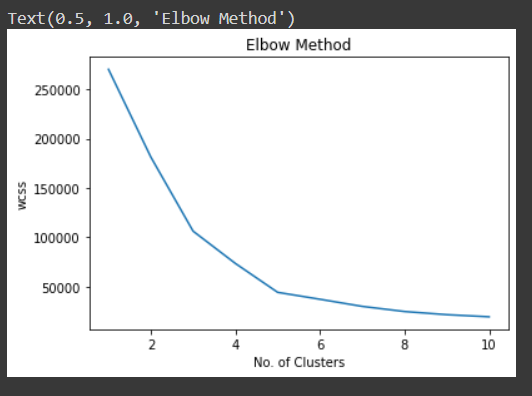
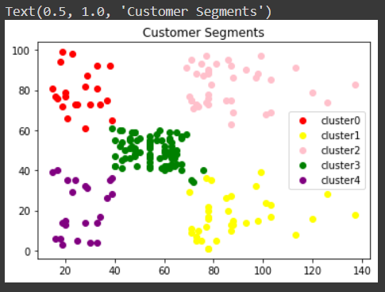

# Implementation-of-K-Means-Clustering-for-Customer-Segmentation

## AIM:
To write a program to implement the K Means Clustering for Customer Segmentation.

## Equipments Required:
1. Hardware – PCs
2. Anaconda – Python 3.7 Installation / Moodle-Code Runner

## Algorithm
1. Import the necessary packages.
2. Read the given csv file and display the few contents of the data.
3. Import KMeans and use for loop to calculate the within cluster sum of squares the data.
4. Plot the wcss for each iteration, also known as the elbow method plot.
5. Predict the clusters and plot them.

## Program:
```
'''
Developed by: bhuvaneshwar v
RegisterNumber: 212221240009
'''
import pandas as pd
import matplotlib.pyplot as plt
d= pd.read_csv("Mall_Customers.csv")
d.head()

d.info()

d.isnull().sum()

from sklearn.cluster import KMeans
wcss=[]
##wcss- within cluster sum of square.It is the squared distance between each point & the centroid in a cluster

for i in range(1,11):
  kmeans=KMeans(n_clusters=i,init="k-means++")
  kmeans.fit(d.iloc[:,3:])
  wcss.append(kmeans.inertia_)

plt.plot(range(1,11),wcss)
plt.xlabel("No. of Clusters")
plt.ylabel("wcss")
plt.title("Elbow Method")

km = KMeans(n_clusters = 5)
km.fit(d.iloc[:,3:])

y_pred = km.predict(d.iloc[:,3:])
d["cluster"] = y_pred
df0 = d[d["cluster"]==0]
df1 = d[d["cluster"]==1]
df2 = d[d["cluster"]==2]
df3 = d[d["cluster"]==3]
df4 = d[d["cluster"]==4]
plt.scatter(df0["Annual Income (k$)"],df0["Spending Score (1-100)"],c="red",label="cluster0")
plt.scatter(df1["Annual Income (k$)"],df1["Spending Score (1-100)"],c="yellow",label="cluster1")
plt.scatter(df2["Annual Income (k$)"],df2["Spending Score (1-100)"],c="pink",label="cluster2")
plt.scatter(df3["Annual Income (k$)"],df3["Spending Score (1-100)"],c="green",label="cluster3")
plt.scatter(df4["Annual Income (k$)"],df4["Spending Score (1-100)"],c="purple",label="cluster4")
plt.legend()
plt.title("Customer Segments")
```

## Output:
## Dataset:


## Dataset information:



## Elbow method graph (wcss vs each iteration):


## Cluster represnting customer segments-graph:


## Result:
Thus the program to implement the K Means Clustering for Customer Segmentation is written and verified using python programming.
